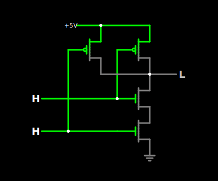
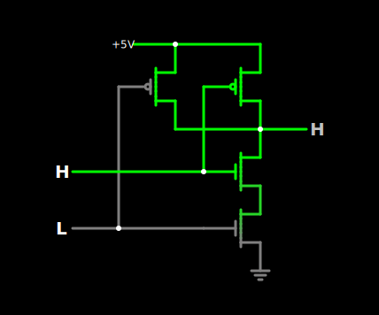
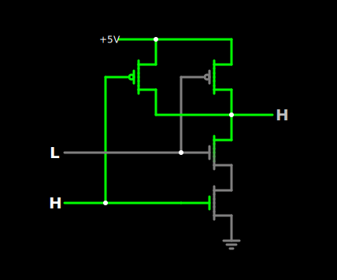
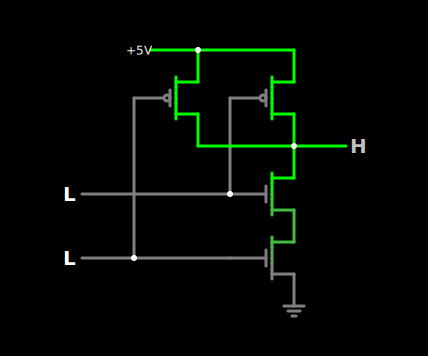

<!---
{
  "id": "bd1f3943-c439-497a-a6a9-513c6ed7ce80",
  "teaches": "The Naive Processor",
  "depends_on": [],
  "author": "Stephan Bökelmann",
  "first_used": "2025-03-28",
  "keywords": ["learning", "exercises", "education", "practice"]
}
--->

# The Naive Processor

## 1) Introduction
In his master-thesis [_A Symbolic Analysis of Relay and Switching Circuits_, from 1937, Claude Shannon](https://doi.org/10.1109/T-AIEE.1938.5057767) explained carefully how every logical mapping can be implemented with switches and wires. 
This was sort of the starting point of digital electronics in the grand scheme of things.
Todays microprocessors are still a combination of wires and switches. 
- With only four transistors, it's possible to build a **NAND-Gate**
- With only these Gates, it's possible to build an **SRAM-Cell**
- With only these two, it's possible to build a **Register**
- With only these, it's possible to build a **Register-File**
- With these, it's possible to build an **ALU**
- And with a little more effort, but no other parts, it's possible to build a **CPU-Core**
Do _not_ let complex block-diagrams and fancy-looking marketing material fool you!
If you know how to build a **NAND-gate** by hand (and with a lot of time), you could build your own computer.
The picture below illustrates the workings of a NAND-gate.

<div style="display: flex; flex-wrap: wrap; justify-content: center; gap: 20px;">

  
  
  
  

</div>

---

Maybe this is a dramatic reduction of the actual problems that arise during manufacturing, but these are not the problems we want to be dealing with in this exercise.

A NAND-gate is called functional complete.
This means, that every boolean statement can be expressed, using only NAND-gates. 
In the early 1900s, Hilbert and in succession Gödel defined, based on Aristotles syllology (with some extra steps in between), which problems can be mechanically and algorithmically solved. 
With the work of Alonzo Church, Alan Turing and Claude Shannon in 1935, '36, and '37, it crystallized, that every algorithmically calculated answer can be expressed using boolean logic. 
Even though, the _Church-Turing-Theorem_ is not formally proven, it is widely regarded as proof for this statement.
Thus the evaluation of every computable answer can be achieved using only NAND-gates. 

<details>
  <summary>Simulating Circuits</summary>
  In this exercise, you will create parts of a naive CPU within a simulation-tool called: **Logisim-Evolution**.
  Alternatively, you may also use tools like [falstads](https://www.falstad.com/circuit/) or [CircuitVerse](https://circuitverse.org/).
  Falstads simulator is a very light-weigt tool to build smaller circuits with quite accurate simulation of electrical measurements, especially if you also want to monitor analog quantities. 
  CircuitVerse is great for smaller digital circuits, but super easy to use. 
  Unfortunately it uses a lot of RAM and gets slow if you inspect larger circuits.
  Logisim-Evolution is a completely open source logic-simulator written in `Java`. 
  It does not run in your browser, which means you will have to install it, but from my perspective it is one of the most convenient tools for circuit simulation out there.
</details>

### 1.1) Further Readings and Other Sources
- [Building an 8-bit breadboard computer! - Ben Eater](https://www.youtube.com/playlist?list=PLowKtXNTBypGqImE405J2565dvjafglHU)
- [NAND is a Functionally Complete Set - Jacob Schrum](https://www.youtube.com/watch?v=2gLtCONHFtU)
- 

## 2) Tasks
1. **Building a CMOS Inverter**: Use [FALSTAD](https://www.falstad.com/circuit/) to build a CMOS-inverter.
2. **Recreate a CMOS NAND**: Use [FALSTAD](https://www.falstad.com/circuit/) to build and simulate all states of a CMOS-NAND.
3. **Adder**: Write down the equations for the two outputs of an 1-bit full-adder. Use a K-Map to isolate the high-potentials in advance! Apply the _de Morgan laws_ to transform the equations into NAND-form 
4. **Implementing the Adder**: Use CircuitVerse to implement a 1-bit full-adder in NAND.
5. **Implementing a 2-bit Adder**: Use CircuitVerse to implement a 2-bit full-adder in NAND.
6. **Building an SRAM Cell**: Use two NAND Gates to build a NAND-latch, also known as SRAM-cell.
7. **Install Logisim-Evolution**: Open your Linux terminal-emulator:
Start with installing the `Java`-Runtime

```sh
sudo apt install default-jre
```
Download _Logisim-Evolution_ and save in your favorite path:

```sh
wget -O <path_to_store_the_program>/logisim-evolution.jar https://github.com/reds-heig/logisim-evolution/releases/latest/download/logisim-evolution.jar
```
<details>
  <summary>Creating a directory</summary>
  It makes sense to create a new directory for this program with `mkdir -p ~/tools/` and store Logisim at `~/tools/logisim-evolution.jar`
</details>

Now you can run _Logisim-Evolution_:

```
java -jar logisim-evolution.jar
```

8. **Recreating the Basic Blocks**: Use _Logisim-Evolution_ to recreate the 2-bit adder and the SRAM-cell.
9. **Multiplexing Demultiplexing**: Research online and try to find a multiplexer (also known as MUX) implementation in NAND.

## 3) Questions
1. **What does it mean that the NAND gate is "functionally complete"?**: Explain how any Boolean logic circuit can be constructed using only NAND gates. Give one example of a basic gate (e.g., AND, OR, NOT) built from NANDs.
2. **How does a CMOS NAND gate work at the transistor level?**: Describe the role of the PMOS and NMOS transistors in a CMOS NAND circuit. What happens in each of the four input combinations?
3. **What are the Boolean equations for the SUM and CARRY outputs of a 1-bit full adder?**: Show the minimized expressions and how they can be translated into pure NAND form using De Morgan's laws.
4. **How does an SRAM cell built from NAND gates store a single bit?**: Explain how feedback between two NAND gates allows information to be stored statically (i.e., without refresh).
5. **What is the purpose of a multiplexer (MUX), and how can it be built using only NAND gates?**: Draw or describe the logic structure of a 2:1 MUX built entirely with NANDs, and explain how the select line affects the output.

## 4) Advice

With the tools you've explored in this exercise — mathematical mappings (like the adder), storage elements (like the SRAM cell), and switching components (like the multiplexer) — you now have everything you need to construct a **naive CPU**.

A CPU, at its core, is not much more than:
- A collection of **registers** (built from SRAM cells),
- A **Register File** to organize and address those registers,
- An **Arithmetic Logic Unit (ALU)** (built from full-adders and simple logic),
- A set of **control lines** (which can be realized with simple state machines),
- And a **multiplexer-based interconnection**, to steer data between the units.

The **multiplexer (MUX)** plays a crucial role: it dynamically connects **selected memory cells (RAM/registers)** to selected inputs of the **mathematical logic** (like adders, subtractors, bitwise operators), depending on the control signals.

Once the computation is done, the **output of the logic** can be **fed back** through another multiplexer path into:
- The same register (e.g., `A = A + 1`),
- A different register (e.g., `C = A + B`),
- Or even into a memory cell, if your design extends beyond registers.

The circuit thus becomes **stateful and reactive**. By adding **control logic and timing**, you can build a working CPU core from these basic components — entirely out of NAND gates.

You are now at a point in your understanding where you can begin to "see through the surface" of microprocessor architectures, and understand them for what they really are:  
> Fast, well-organized networks of switches and memory.


